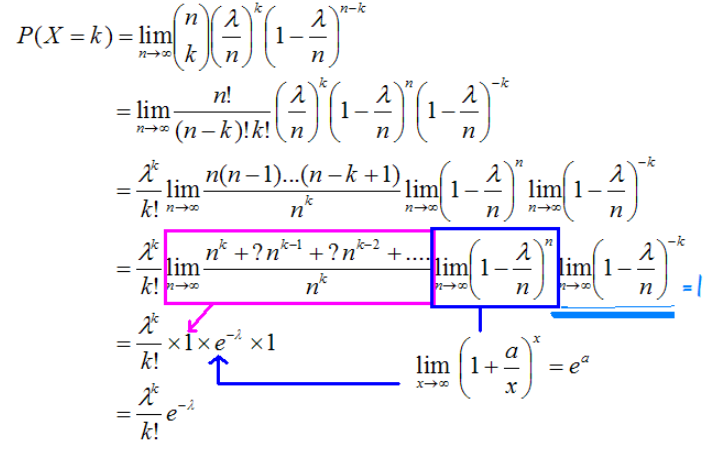

# Learning Notes of E12-26 统计学基本知识、二项及泊松分布  
# Learning Notes E27-34 大数定律、正态分布  

## 1.测量数据的集中趋势(Measure of Central Tendency)  
+ 样本和总体: Sample & Population
+ μ: Population mean  

+ x_bar: sample mean  

## 2.测量数据的离中趋势(Measure of Dispersion)
+ S^2 or δ^2(sigma squared): Variance(方差)  
  总方差公式：   
  其中xi - μ为每个样本到均值的距离，在取平方后都为正，所以这相当于集合中每个数同均值之间距离绝对值的平方，再除以总样本个数N。
  实际工作中，总体均数难以得到时，应用样本统计量代替总体参数（无偏样本方差，Unbiased sample variance），经校正后，样本方差计算公式：  
  比起总方差公式中的除以N，这里除以n-1，因为样本均值或多或少会与总体均值有差距（样本的选择不一定能做到平均分布，很可能会偏向一边（be skewed），则样本均值也会偏向于被选样本，导致得出的样本离散程度低），当差距过大的时候，除以n后得到的方差会被低估（underestimated），即远低于总方差，这时需要人工调整为除以n-1来稍微调大样本方差。  
  
 + S or δ: Standard Deviation(标准差)  
   标准差在方差的基础上来看很简单，就是方差的平方根，总体标准差记作δ，样本的标准差记作S
   使用标准差的好处：
   1. 标准差的单位更好，当数据单位为cm，则方差计算结果单位为cm^2，与数据单位不符合，而标准差计算结果单位为cm
   2. 假设事物分布是钟型曲线，这可以帮助求得事物落在均值一两个标准差范围内的概率  
   总方差公式拆开变形后可以得到：  
     
   因此求总体方差公式可以化简为：总体所有数的平方和除以样本总数，然后减去总体所有数之和的平方除以样本总数的平方，不用算均值，直接计算样本就可得总体方差，即诸方差公式。（也可先计算出均值再计算总方差，如何方便如何算）。
   
 + 随机变量 Random Variable  
    与传统变量区分，随机变量用大写字母X, Y, Z表示；本质上随机变量可以认为是一个函数，将随机过程映射为一个数字(that map a random process to a number)，如果想量化一个随机过程(quantify a random process)，比如明天是否下雨这个事件设为X，可以将明天下雨设置为1，不下雨设置为0，X=1则下雨，X=0则不下雨，实现量化映射过程，这个映射数字是随机的，因为我们也不知道是否会下雨。  

 + Types of random variables:    
   1. Discrete Random Variables(离散型随机变量)，可以取有限多个或无限多个数值（如0，1,2,3,4....）的随机变量: 抛色子，预测明天是否下雨等。  
   2. Continuous Random Variables(连续型随机变量)，可以在某一区间或多个区间内任意取值的随机变量: 明天雨量的英寸数(X = the exact amount of rain in inches tomorrow)。  度量、时间、重量、距离温度时，其试验结果都可以用连续型随机变量来描述。  
     
     
     
   
 + 概率密度函数(PDF: Probability density function):  
   + 又称之为频率函数（frequency function），或者概率分布（probability distribution），用来表示连续型随机变量的概率分布情况，一般是一条光滑的曲线。  
   + In business applications, many a times, even though the data may be strictly discrete. For example annual salaries of employees, revenues earned by companies, etc. We still end up using a continuous distribution to model or characterize such data.
The reason being that the most popular and well-understood distribution, the normal distribution, happens to be a continuous distribution.
This kind of approximation is widely used and frankly speaking is okay for a majority of applications.  
     
     
     
     
     
     
     
     
     
     
     
     
     
   
 + 二项分布(Binomial distribution)  
二项分布是一种具有广泛用途的离散型随机变量的概率分布，它是由贝努里始创的，所以又叫贝努里分布。
二项分布是指统计变量中只有性质不同的两项群体的概率分布。所谓两项群体是按两种不同性质划分的统计变量，是二项试验的结果。即各个变量都可归为两个不同性质中的一个，两个观测值是对立的。因而两项分布又可说是两个对立事件的概率分布。  
  E.g. X = the number heads after 5 flips of a fair coin:  
  P(TTTTT) = (1/2)^5 = 1/32(There are 32 scenarios all together),   
  P(X=1) = 5 * 1/32 = 5/32(The one head can appear in any one of the 5 flips).  
  P(x=2) = ((5 * 4) / 2) /32 = 5!/(2! * 3!) *第一个H可以出现在5种情况中的任意一种， 第二个H则只有四种选择，因此5X4，然后要除以这两个H之间的2种排列情况，则一共有5X4/2=10种情况，再除以总共的32种情况则为 5 flips中出现两次H的概率。*  
  P(x=3) = 5! / (3! * 2!)
    
    
    
    
  
  + 二项分布的应用条件  
    1．各观察单位只能具有相互对立的一种结果，如阳性或阴性，属于两分类资料。  
    2．已知发生某一结果（阳性）的概率为π，其对立结果的概率为1-π，实际工作中要求π是从大量观察中获得比较稳定的数值。  
    3．n次试验在相同条件下进行，且各个观察单位的观察结果相互独立，即每个观察单位的观察结果不会影响到其他观察单位的结果。如要求疾病无传染性、无家族性等。
    
  + E：期望值  
    在概率论和统计学中，一个离散性随机变量的期望值（或数学期望，亦简称期望，物理学中称为期待值）是试验中每次可能的结果乘以其结果概率的总和。换句话说，期望值像是随机试验在同样的机会下重复多次，所有那些可能状态平均的结果，便基本上等同“期望值”所期望的数。期望值可能与每一个结果都不相等。换句话说，期望值是该变量输出值的加权平均。期望值并不一定包含于其分布值域，也并不一定等于值域平均值。  
    例如，掷一枚公平的六面骰子，其每次“点数”的期望值是3.5，计算如下：  
      
    不过如上所说明的，3.5虽是“点数”的期望值，但却不属于可能结果中的任一个，没有可能掷出此点数。  
      
      
    
  + Poisson Distribution(泊松分布)  
      
      
    假设概率分布是一致的，例如不会因时间段不同而异，又假设各事件的概率是不相关的（即不相互影响），符合泊松分布Poission distribution。例如某个路口一小时内有多少量车经过。  
    E(X)=λ，期望值是λ。我们将计算P(X=k)时出现的概率。
    如果根据二项分布进行计算，每一分钟有一辆车经过则为状态成功，没有则为另一状态，每分钟的期望值是λ/60。但这样计算有一个问题，如果一分钟内同时有两辆车经过呢？这种计算就不对。如果我们改为一秒钟有一辆车经过为状态成功，没有则为另一个状态，每秒钟的期望值是λ/3600，这样计算会更为精确，因为一秒钟内同时有两辆车的几率会很少，也就是对结果的干扰更少。如果需要更精确，我们将时间分割得更小，也就是λ/n，n趋于无穷，将可推导出泊松分布。  
      
    泊松分布和二项分布用于不同的场景，对于泊松分布，状态不止两个，上例子，一分钟内可能有0、1、2、3……辆车经过，只有分割无穷小，才趋向0、1两个状态。n是趋向无穷，不是一个固定的数，例如投N次硬币。泊松分布适合于描述单位时间内随机事件发生的次数的概率分布。
 
  + 大数定律 Law of Larger Numbers  
  X是随机变量，E（X）是期望值。  

  ，X是随机变量，E（X）是期望值。

  以X=抛投100个/次fair coin正面的个/次数。当我们不断地抛100次，当抛了无数次100次硬币时，平均每次测试的正面coin就趋向于50。

  ，当→∞时， →50。

   在上面的例子中，我们看到头2次都是大于50，不要误认为后面的就有小于50的趋势，因为每次抛投都是孤立，是不相干的时间，当n趋向无穷时，就趋向50。
