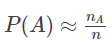
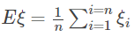
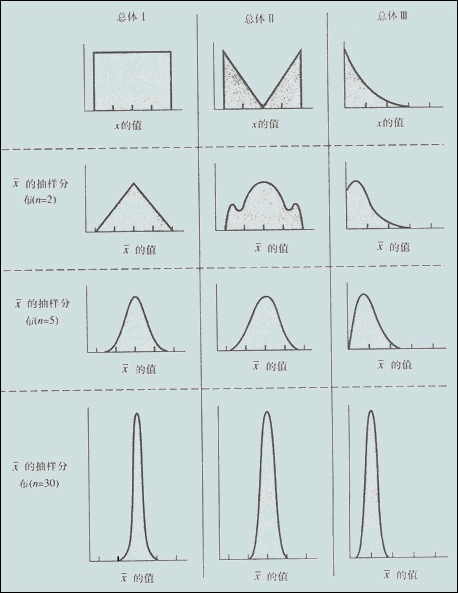
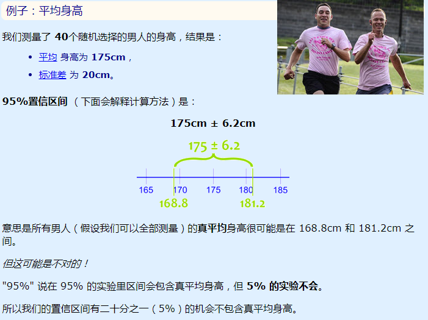
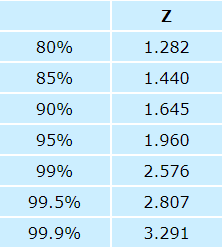
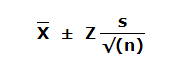
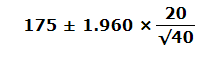
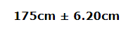

# Learning Notes E35-46 中心极限定理， 置信区间  
+ ### 大数定律 Law of Large Number 
  + 大数定律就以严格的数学形式表现了随机现象的一个性质：平稳结果的稳定性（或者说频率的稳定性）  
  + 大数定律从理论上解决：用频率近似代替概率的问题：；用样本均值近似代替理论均值：  
  
+ ### 中心极限定理 Central limit theorem  
  + 在适当的条件下，大量相互独立随机变量的均值经适当标准化后依分布收敛于正态分布。例如我们要计算全中国人的平均身高。如果每次取10000个身高作为样本，对应有一个样本均值。如果再从总体中重复抽取n多次10000个样本，就对应有n个样本均值。随着n增大，把所有样本均值画出来，得到的就是一个接近正太分布的曲线。 
  + 当样本量N逐渐趋于无穷大时，N个抽样样本的均值的频数逐渐趋于正态分布，其对原总体的分布不做任何要求，意味着无论总体是什么分布，其抽样样本的均值的频数的分布都随着抽样数的增多而趋于正态分布。 
      
    
+ ### 大数定律与中心极限定理之间的区别
  + 大数定律是说，n只要越来越大，我把这n个独立同分布的数加起来去除以n得到的这个样本均值（也是一个随机变量）会依概率收敛到真值u，但是样本均值的分布是怎样的我们不知道。  
  + 中心极限定理是说，n只要越来越大，这n个数的样本均值会趋近于正态分布，并且这个正态分布以u为均值，sigma^2/n为方差。  
  + 综上所述，这两个定律都是在说样本均值性质。随着n增大，大数定律说样本均值几乎必然等于均值。中心极限定律说，他越来越趋近于正态分布。并且这个正态分布的方差越来越小。直观上来讲，想到大数定律的时候，你脑海里浮现的应该是一个样本，而想到中心极限定理的时候脑海里应该浮现出很多个样本。  
  
+ ### 置信区间 Confidence Interval  
  + 一般我们用中括号[a,b]表示样本估计总体平均值误差范围的区间。a、b的具体数值取决于你对于”该区间包含总体均值”这一结果的可信程度，因此[a,b]被称为置信区间。置信区间是一个我们相当肯定是包含真实值的数值范围。    
  + 一般来说，选定某一个置信区间，我们的目的是为了让”ab之间包含总体平均值”的结果有一特定的概率，这个概率就是所谓的置信水平。  
  + 例如我们最常用的95%置信水平，就是说做100次抽样，有95次的置信区间包含了总体均值。  
    
  
  + 计算置信区间  
  一、写下样本的数量 n，接着求这些样本的平均值 X 和 标准差 s：  
     + 样本的数量：n = 40  
     + 平均：X = 175  
     + 标准差：s = 20  
     
   二、决定我们用哪个置信区间，通常是 90%、95% 和 99%。然后在这查这个 "Z"值：  
     +   
     95% 的 Z值是 1.960  
     
   三、把 Z值代入以下的公式来求置信区间  
        
      结果是：  
                  
      就是：从 168.8cm 到 181.2cm
      
 [Source：数学乐](https://www.shuxuele.com/data/confidence-interval.html)  
 [Reference: MBA智库](https://wiki.mbalib.com/wiki/%E7%BD%AE%E4%BF%A1%E5%8C%BA%E9%97%B4)  
 [Reference: CSDN博客](https://blog.csdn.net/bitcarmanlee/article/details/82709774)  
      

